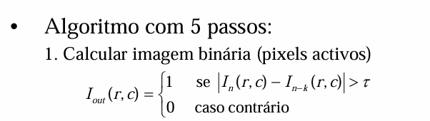
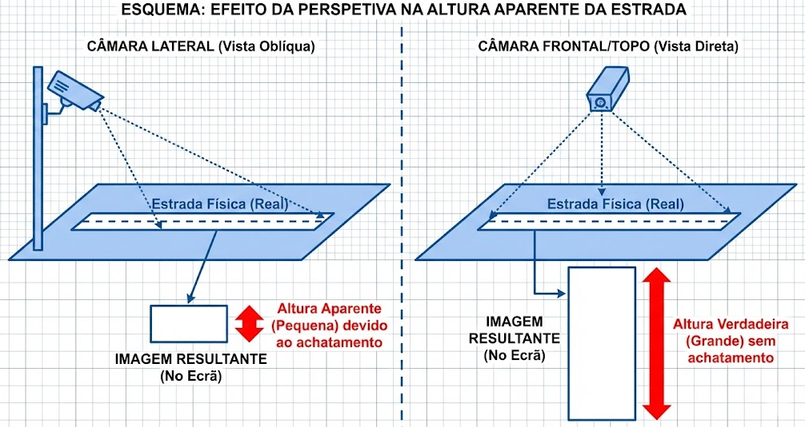
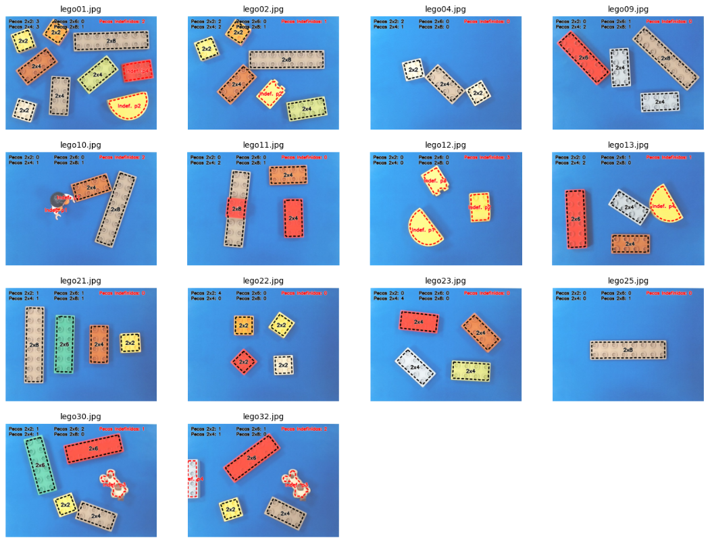

<a id="readme-top"></a>

<!-- PROJECT LOGO & HEADER -->
<br />
<div align="center">
  <a href="https://github.com/GuilhermeGraca/python-computer-vision">
    
  </a>

  <h3 align="center">Traffic Flow & Lego Sorting Vision Systems</h3>

  <p align="center">
    Two computer vision pipelines built to detect, track, and analyze real-world objects using raw image processing techniques.
    <br />
    <br />
    <a href="#about-the-project"><strong>Explore the Documentation »</strong></a>
    <br />
    <br />
    <a href="https://github.com/GuilhermeGraca/python-computer-vision/issues">Report Bug</a>
    &middot;
    <a href="https://github.com/GuilhermeGraca/python-computer-vision/issues">Request Feature</a>
  </p>
</div>

<!-- TABLE OF CONTENTS -->
<details>
  <summary>Table of Contents</summary>
  <ol>
    <li>
      <a href="#about-the-project">About The Project</a>
      <ul>
        <li><a href="#built-with">Built With</a></li>
        <li><a href="#features--key-highlights">Features & Key Highlights</a></li>
      </ul>
    </li>
    <li><a href="#project-breakdown">Project Breakdown</a></li>
    <li><a href="#lessons-learned">Lessons Learned</a></li>
    <li>
      <a href="#getting-started">Getting Started</a>
      <ul>
        <li><a href="#prerequisites">Prerequisites</a></li>
        <li><a href="#installation--running-locally">Installation & Running Locally</a></li>
      </ul>
    </li>
    <li><a href="#contact">Contact</a></li>
    <li><a href="#acknowledgments">Acknowledgments</a></li>
  </ol>
</details>

---

<!-- ABOUT THE PROJECT -->
## About The Project

<div align="center">


https://github.com/user-attachments/assets/b52ed7ae-9a13-4e3b-82bd-84e15ec48b6d


  <br/>
  <em>Final output of the Traffic Flow system: Vehicles are tracked continuously within a specific region of interest, and their real-time speeds (km/h) are calculated across three highway lanes.</em>
  <br/><br/><br/>
  
https://github.com/user-attachments/assets/fe6c6998-50d3-478d-a962-9d0fa25bd214


  <br/>
  <em>Video demonstration of the piece extraction and geometric classification stages.</em>
</div>
<br />

This repository contains **Traffic Flow & Lego Sorting Vision Systems**, an academic project developed from scratch in collaboration with **Martim Ramos** for the *Image Processing and Vision* course at **ISEL (Instituto Superior de Engenharia de Lisboa)** in 2025. 

The primary goal of this project is to apply core computer vision algorithms without relying on deep learning models. It solves two distinct problems: counting and tracking vehicles on a highway, and classifying Lego pieces based on their geometric properties. 

*Note: The detailed source documentation and step-by-step logic are written in Portuguese inside the Jupyter Notebooks, which are also exported as PDF files.*

<p align="right">(<a href="#readme-top">back to top</a>)</p>

---

### Built With

* [![Python][Python-badge]][Python-url]
* [![OpenCV][OpenCV-badge]][OpenCV-url]
* [![NumPy][NumPy-badge]][NumPy-url]
* [![Matplotlib][Matplotlib-badge]][Matplotlib-url]

<p align="right">(<a href="#readme-top">back to top</a>)</p>

---

### Features & Key Highlights

* **Background Subtraction**: Dynamic background estimation using temporal median filtering to isolate moving vehicles.
* **Smart Tracking (TTL)**: Advanced object tracking utilizing Euclidean distance matching and "Time to Live" memory for bounding boxes that flicker near borders.
* **Perspective Calibration**: Homography matrix transformation converting standard 2D camera views into precise top-down layouts to measure real-world speeds.
* **Color Pre-processing Masking**: Resolving contrast issues via selective color replacement (masking green legos to red) before attempting Otsu binarization.
* **Advanced Contour Geometry**: Creating custom classification logic using polygon approximation, bounding box constraints, and centroid moments to accurately type Lego bricks.

<p align="right">(<a href="#readme-top">back to top</a>)</p>

---

## Project Breakdown

### 1. Traffic Vehicle Counting & Speed Estimation

<div align="center">


https://github.com/user-attachments/assets/4b0f272b-6513-45b8-a78f-3f3315589942


  <br/>
  <em>A full run-through of the pipeline, displaying each internal stage of processing side-by-side.</em>
</div>
<br/>

**The Processing Pipeline**
This system processes a live highway video feed to accurately monitor traffic. The pipeline acts sequentially as follows:
1. **Background Subtraction**: A static version of the road is estimated by analyzing the median values of pixels over time. We then calculate the absolute difference between each frame and this static background to detect active movement.
   <div align="center">
     <figure style="display:inline-block; margin: 10px;">
       
     </figure>
   </div>

2. **Morphological Noise Cleaning**: The raw active pixels contain significant noise (from shadows, shaking trees). We apply morphological **Open** to remove this small noise, followed by a **Close** operator to fill in the gaps inside the vehicle bodies, generating solid blocks of white pixels for the cars.
   <div align="center">
     <figure style="display:inline-block; margin: 10px;">
       
       
     </figure>
   </div>

3. **Speed & Perspective Warping**: To calculate real-world speed (km/h), tracking pixel distances directly is inaccurate due to perspective distortion (cars far away look smaller and move fewer pixels). A Homography matrix converts the Region of Interest (ROI) into a top-down view. Using real road measurements (e.g., lane widths of 3.75m), we can translate pixel velocity into metric speed.
   <div align="center">
     <figure style="display:inline-block; margin: 10px;">
       
     </figure>
   </div>

---

### 2. Lego Piece Classification

<div align="center">


  
  <br/>
  <em>Final output of the Lego Sorting system: Scattered Lego bricks are successfully extracted from the background, their shapes classified by dimensions, and colored contours are drawn based on piece type.</em>
</div>
<br/>

**The Processing Pipeline**
This script processes images of scattered Lego bricks on a blue table, identifies them, and draws accurate boundaries and text labels representing their size.
1. **Color Extraction & Masking**: Through histogram analysis, the Red channel proved best for isolation. However, some green bricks blended into the background. To resolve this, green bricks were selectively masked and recolored to red prior to Otsu thresholding.
2. **Component Morphing**: Similar to the traffic pipeline, morphological kernels were used to erode false connections between pieces, and then dilate them back to restore their true shapes.
3. **Geometric Typing**: Using OpenCV's `approxPolyDP` and `minAreaRect`, each connected component was reduced to a polygon, checked for rectilinearity, and its area was evaluated to determine if it belonged to the 2x2, 2x4, 2x6, or 2x8 categories.

<p align="right">(<a href="#readme-top">back to top</a>)</p>

---

<!-- LESSONS LEARNED -->
## Lessons Learned

* **Adaptive Thresholding**: Standard binarization struggles heavily with shadows; calculating thresholds dynamically based on background standard deviation greatly improved vehicle extraction.
* **Color Channel Manipulation**: Exploring histograms revealed that analyzing individual RGB channels (specifically the Red channel) is often vastly superior to grayscale for piece isolation.
* **Temporal Tracking Jitter**: Calculating speed based on frame-by-frame distance produces huge noise due to bounding-box jitter. Averaging distance over a gap of 5 frames completely resolved the velocity fluctuations.
* **Component Masking**: Attempting to force one binarization threshold on all colors is flawed. Pre-processing the image by selectively re-coloring problematic pieces (green pieces to red) created a robust pipeline for Otsu thresholding.

<p align="right">(<a href="#readme-top">back to top</a>)</p>

---

<!-- GETTING STARTED -->
## Getting Started

Follow these instructions to set up a local copy of the project on your machine.

### Prerequisites

* Python 3.9+
* Jupyter Notebook

### Installation & Running Locally

1. **Clone the repository**:
   ```sh
   git clone https://github.com/GuilhermeGraca/python-computer-vision.git
   ```
2. **Navigate to the directory**:
   ```sh
   cd python-computer-vision
   ```
3. **Install the required libraries**:
   ```sh
   pip install -r requirements.txt
   ```
4. **Run the notebooks**:
   ```sh
   jupyter notebook
   ```
   *Open either `traffic-vehicle-counting.ipynb` ou `lego-piece-classification.ipynb` and run all cells sequentially.*

<p align="right">(<a href="#readme-top">back to top</a>)</p>

---

<!-- CONTACT -->
## Contact

Guilherme Graça - [LinkedIn](https://www.linkedin.com/in/guilherme-graca/) - [GitHub](https://github.com/GuilhermeGraca)

<p align="right">(<a href="#readme-top">back to top</a>)</p>

---

<!-- ACKNOWLEDGMENTS -->
## Acknowledgments

* **Martim Ramos** - For the collaboration and teamwork in developing this academic project.
* **ISEL (Instituto Superior de Engenharia de Lisboa)** - For the academic foundation provided during the Image Processing and Vision course.

<p align="right">(<a href="#readme-top">back to top</a>)</p>

[Python-badge]: https://img.shields.io/badge/Python-3776AB?style=for-the-badge&logo=python&logoColor=white
[Python-url]: https://www.python.org/
[OpenCV-badge]: https://img.shields.io/badge/OpenCV-5C3EE8?style=for-the-badge&logo=opencv&logoColor=white
[OpenCV-url]: https://opencv.org/
[NumPy-badge]: https://img.shields.io/badge/Numpy-777BB4?style=for-the-badge&logo=numpy&logoColor=white
[NumPy-url]: https://numpy.org/
[Matplotlib-badge]: https://img.shields.io/badge/Matplotlib-11557c?style=for-the-badge&logo=python&logoColor=white
[Matplotlib-url]: https://matplotlib.org/
